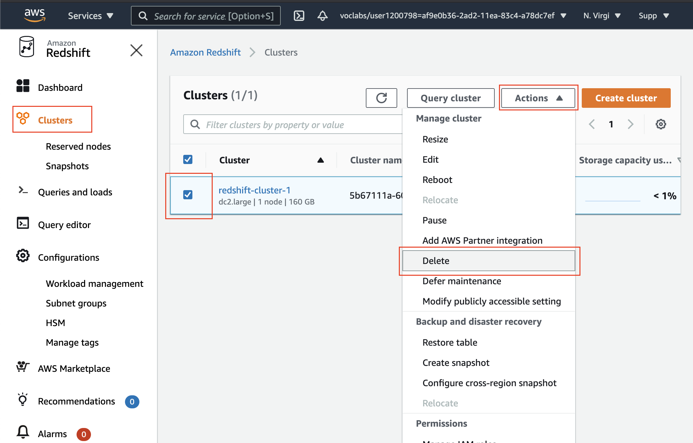
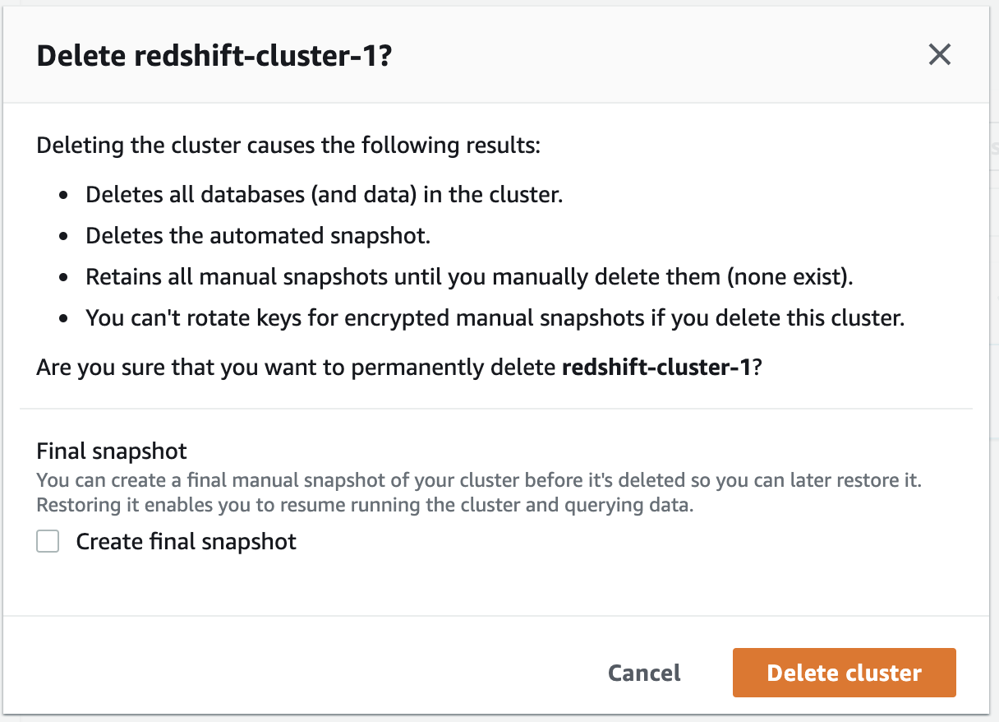

#### Delete a Redshift Cluster

Make sure to delete your cluster each time you're finished working to avoid large, unexpected costs. You can always launch a new cluster, so don't leave it running overnight or throughout the week if you don't need to.

Steps to delete a cluster are:

   1. On the **Clusters** page of your Amazon Redshift console, click on the check-box next to your cluster name. Then click on the **Actions** drop-down button on top → select **Delete**.

 

||
|:--:|
|*Delete a cluster*|

 

   2. You can choose to not **Create final snapshot**, and click on the **Delete cluster** button.

 

||
|:--:|
|*Prompt before deleting the cluster*|

 

   3. Your cluster will change it's status to **deleting**, and then disappear from your Cluster list once it's finished deleting. You'll no longer be charged for this cluster.

