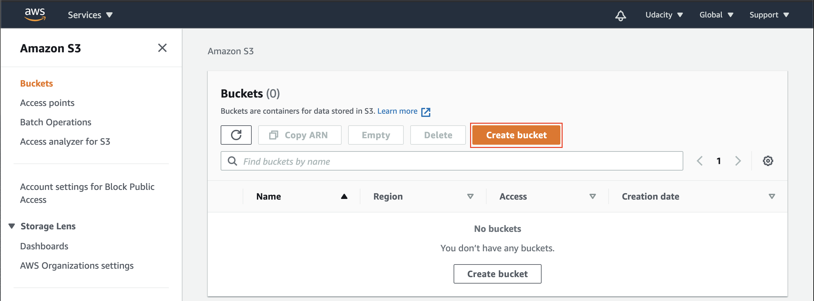
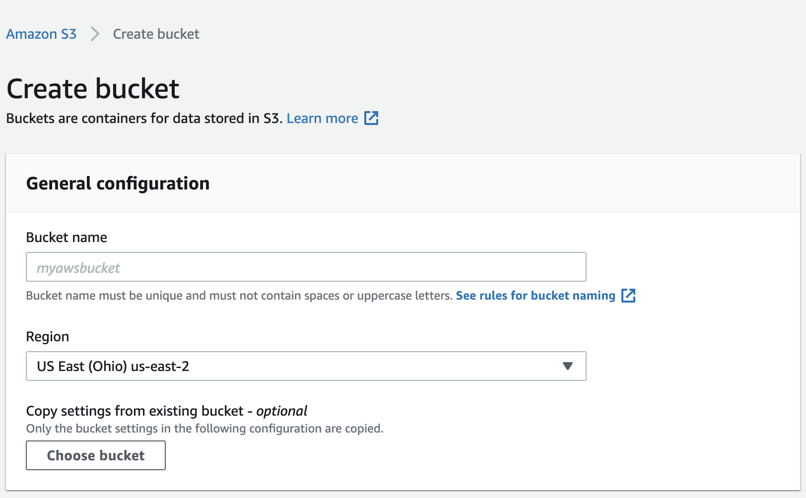
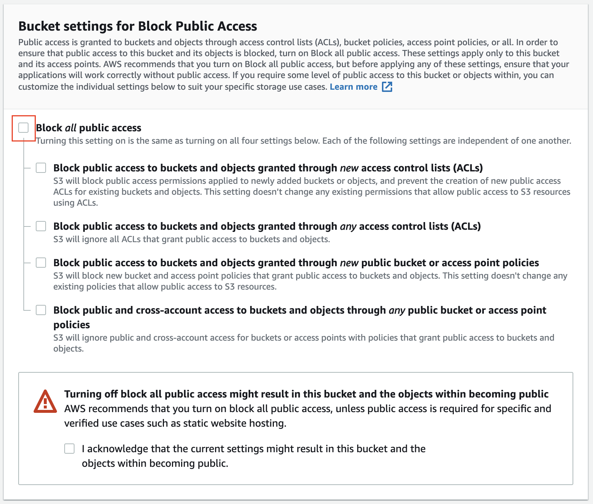
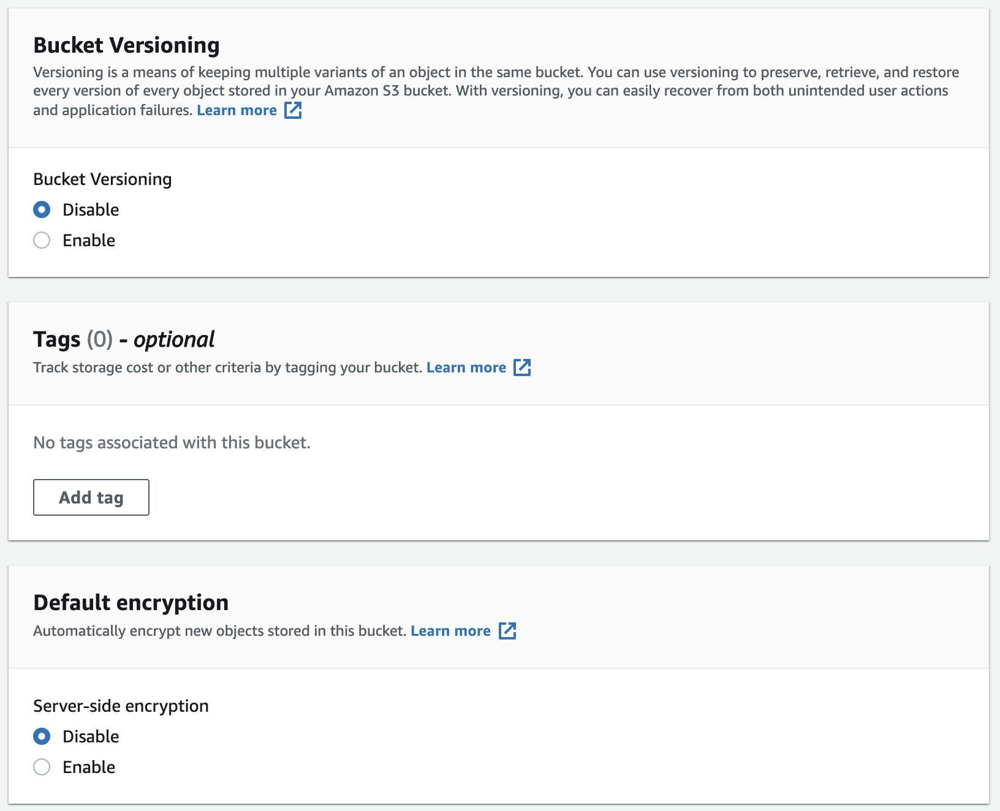
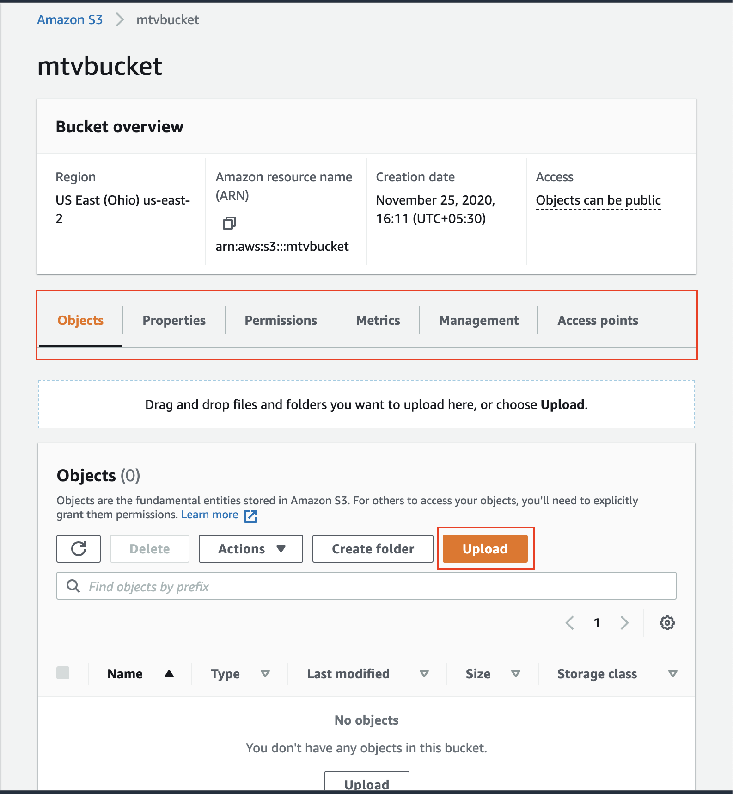
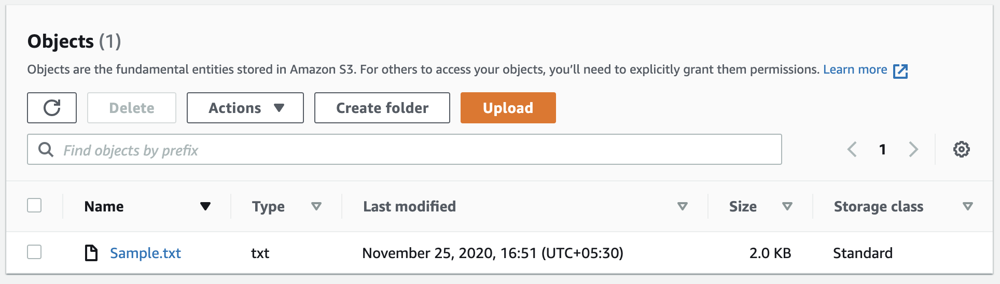
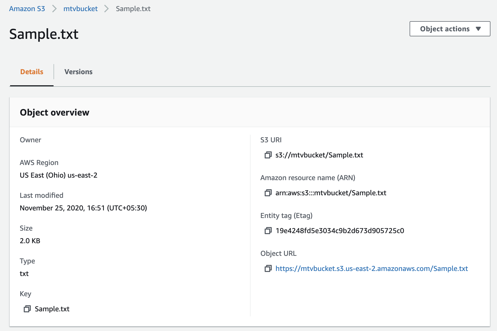

Let's learn how to create a bucket in [Amazon S3](https://docs.aws.amazon.com/AmazonS3/latest/gsg/GetStartedWithS3.html), and view a few properties of an existing bucket.

#### Create a Bucket

   1. Navigate to the (S3 dashboard)[https://classroom.udacity.com/nanodegrees/nd027/parts/bb5828e0-2c01-4632-b79a-472e5f9a5d1d/modules/4bd17bdc-8013-449d-b334-5c2c75d39a63/lessons/f27059b5-5894-4f47-9fe1-d4d413c30cf6/concepts/console.aws.amazon.com/s3/home], and click on the **Create bucket** button. It will launch a new wizard.

<br />

||
|:--:|
|*S3 service → Buckets dashboard.*<br />
*View all of the S3 buckets in your account*<br />
*(S3 is a global service, not a region-specific).*|

<br />


We create a bucket first, and later we upload files and folders to it.

   2. **General configuration**
    Provide the bucket-name and the region where you want to locate the bucket. The bucket name must be unique worldwide, and must not contain spaces or uppercase letters.

<br />

||
|:--:|
|*Create a bucket - Provide general details*|

<br />


   3. **Public Access settings**
    You can choose public visibility. Let's uncheck the Block all public access option.

<br />

||
|:--:|
|*Create a bucket - Make it public*|

<br />

   4. **Bucket Versioning and Encryption**
        * Bucket Versioning - Keep it disabled.
        * Encryption - If enabled, it will encrypt the files being stored in the bucket.
        * Object Lock - If enables, it will prevent the files in the bucket from being deleted or modified.

   3. **Public Access settings**
    You can choose public visibility. Let's uncheck the Block all public access option.

<br />

||
|:--:|
|*Create a bucket - Provide additional details*|

<br />


In the snapshots above, we have created a public bucket. Let's see **how to upload files and folders to the bucket**, and configure additional settings.

##### Upload File/Folders to the Bucket

From the (S3 dashboard)[https://classroom.udacity.com/nanodegrees/nd027/parts/bb5828e0-2c01-4632-b79a-472e5f9a5d1d/modules/4bd17bdc-8013-449d-b334-5c2c75d39a63/lessons/f27059b5-5894-4f47-9fe1-d4d413c30cf6/concepts/console.aws.amazon.com/s3/home], click on the name of the bucket you have created in the step above.

<br />

||
|:--:|
|*Details of an existing bucket. Upload files/folders to this bucket.*|

<br />


In the snapshot above, it shows that the bucket is in the Region: ```US East (Ohio) us-east-2```, and it has a unique Amazon resource name (ARN): ```arn:aws:s3:::mtvbucket```. You can view more details of the bucket, in the tabs next to the bucket overview: **Objects, Properties, Permissions, Metrics, Management**, and **Access points**. Leet's upload a sample file to the bucket:

   1. Click on the **Upload** button to upload files and folders into the current bucket. In the snapshot below, we have uploaded a **Sample.txt** file.

<br />

||
|:--:|
|*A sample file in the bucket*|

<br />


   2. Click on the file name to view the file-specific details, as shown below.

<br />

||
|:--:|
|*Details of an individual file (object)*|

<br />

#### Details of an Existing Bucket
**1. Properties**

There are several properties that you can set for S3 buckets, such as:

   * Bucket Versioning - Allows you to keep multiple versions of an object in the same bucket.
   * Static website hosting - Mark if the bucket is used to host a website. S3 is a very cost-effective and cheap solution for serving up static web content.
   * Requester pays - Make the requester pays for requests and data transfer costs.
   * Server access logging - Log requests for access to your bucket.
   * **Permissions**

It shows who has access to the S3 bucket, and who has access to the data within the bucket. In the example snapshots above, the bucket is public, meaning anyone can access it. Here, we can write an access policy (in JSON format) to provides access to the objects stored in the bucket.

**2. Metrics**

View the metrics for usage, request, and data transfer activity within your bucket, such as, total bucket size, total number of objects, and storage class analysis.

**3. Management**

It allows you to create life cycle rules to help manage your objects. It includes rules such as transitioning objects to another storage class, archiving them, or deleting them after a specified period of time.

**4. Access points**

Here, you can create access endpoints for sharing the bucket at scale. Using an endpoint, you can perform all regular operations on the bucket.
