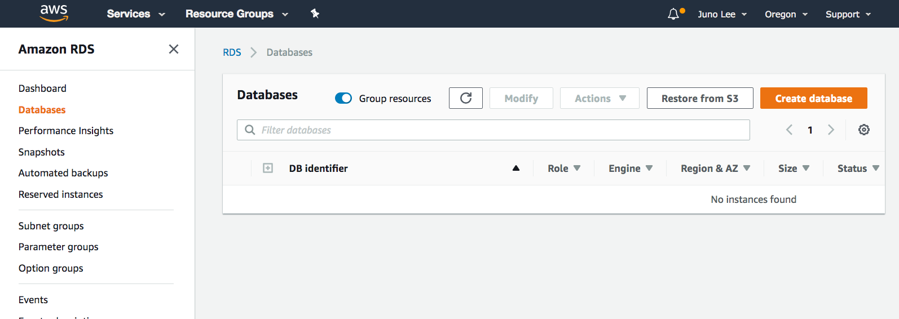
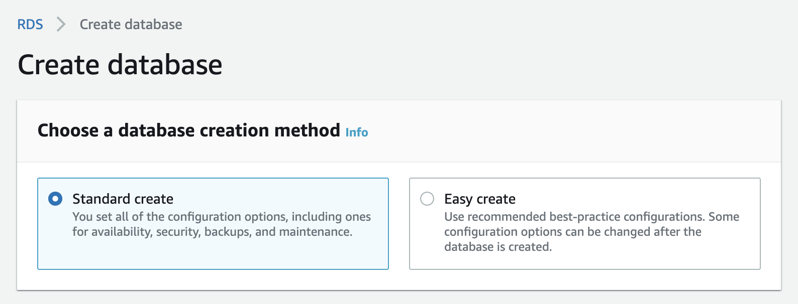
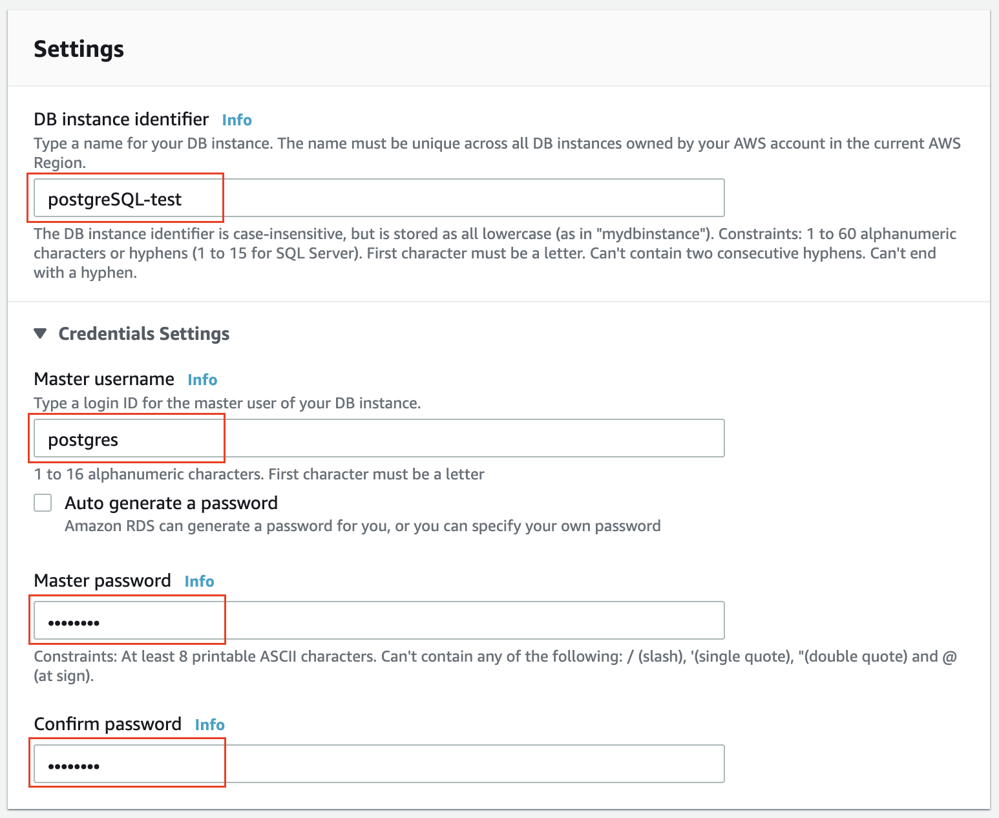
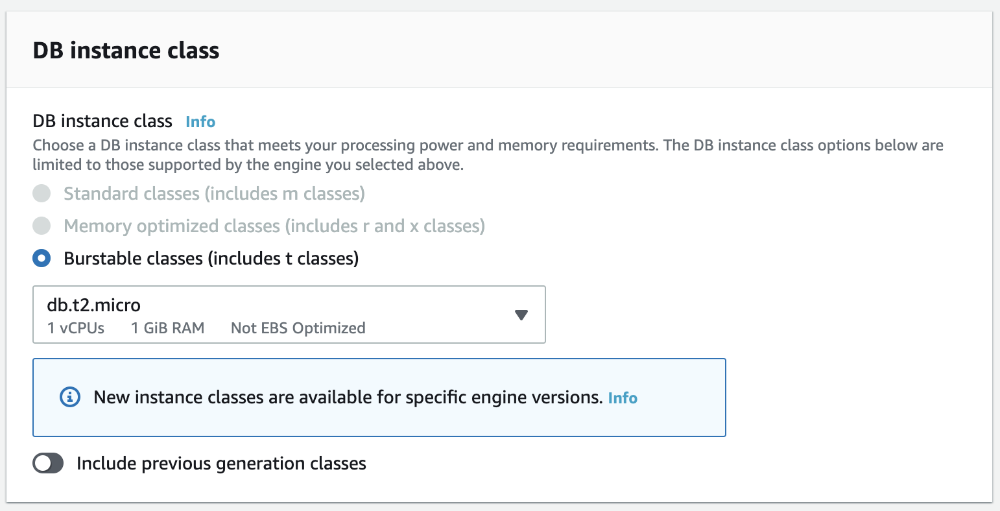
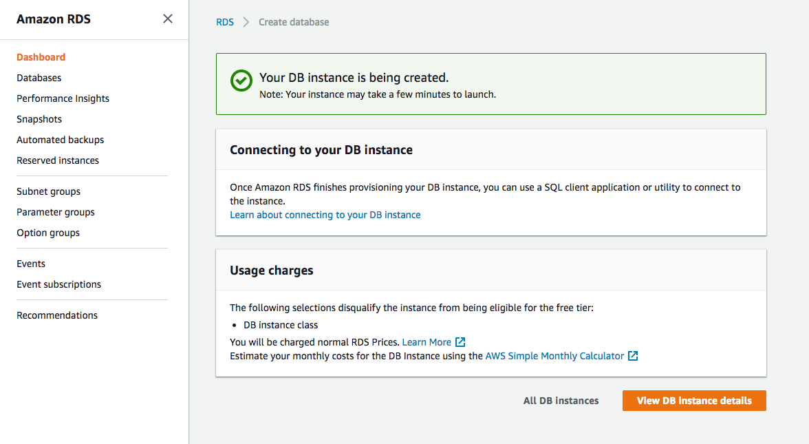

According to AWS:

   [Amazon RDS](https://docs.aws.amazon.com/AmazonRDS/latest/UserGuide/Welcome.html) is a relational database service that manages common database administration tasks, resizes automatically, and is cost-friendly.

Let's see how to create a PostgresSQL database, and view the details of an existing database.

#### RDS Dashboard

Navigate to the [RDS dashboard](https://console.aws.amazon.com/rds/home). It shows the database-resources summary, such as the count of database instances, the health of the database service, reserved instances, snapshots. You can also view the portion of the allocated storage. You can launch the **Create database** wizard from here.

<br />

||
|:--:|
|*RDS dashboard*|

<br />

#### Create a PostgreSQL DB

If you haven't launched already, choose the **Databases** menu item on the left navigation pane, and click on the **Create Database** button.

<br />

||
|:--:|
|*Amazon RDS service → Databases dashboard*|

<br />

   1. **Choose a database creation method**
   
   AWS provides two options to choose from:
       * Standard create - You have set all of the configuration options, including ones for availability, security, backups, and maintenance.
       * Easy create - You use the industry best-practice configurations. All configuration options, except the Encryption and VPC details, can be changed after the database is created.

   The steps below will show you the **Standard create** fields/options.

<br />

||
|:--:|
|*Choose a database creation method*|

<br />

   2. **Engine options**
   
   Select **PostgreSQL** option. It will pick up the latest stable release by default, though you can select a version of your choice as well.

<br />

||
|:--:|
|*Engine options*|

<br />

   3. **Templates**
   
   Use either the **RDS Free Tier** or **Dev/Test** template. On free-tier resources, you can develop and test applications to gain hands-on experience with Amazon RDS.
   
   The free tier will offer you 750 hrs of Amazon RDS in a Single-AZ ```db.t2.micro``` Instance, 20 GB of General Purpose Storage (SSD), and 20 GB for automated backup storage and any user-initiated DB Snapshots.

<br />

||
|:--:|
|*Templates*|

<br />

   4. **Settings**
   
   Provide a *DB instance identifier*, such as *postgreSQL-test*, and master credentials (username and a password). Take note of this password, as it is useful for future steps. You will be able to find this password and change it later in the console.

   Alternatively, you can auto-generate the password. In this case, AWS will show you the password once you create the database successfully.

<br />

||
|:--:|
|*Settings*|

<br />

   5. **DB instance class**
   
   The options here present the options for processing power and memory requirements. Since we have selected the Free tier option above, the only available option is ```db.t2.micro```, which has 1 vCPU, and 1 GiB RAM.

<br />

||
|:--:|
|*DB instance class*|

<br />


   8. **Storage and Availability & durability**
   
   Choose the default values for both these sections. It will offer you 20 GiB SSD storage, expandable up to 1000 GiB, by default. For *Availability & durability* section, it will not offer us to have a Multi-AZ deployment.

<br />

||
|:--:|
|*Storage and Availability & durability*|

<br />

   7. **Connectivity**
   
   Choose/ensure the following values:

<br />


<br />

   **Leave the values default for the Database authentication section.**

<br />

||
|:--:|
|*Connectivity*|

<br />

   8. **Additional configuration**
   
   * Provide the database name. If you do not specify a database name, Amazon RDS will not create a database.
   * In the *Backup* section and select *1 day*, since this is for demonstration purposes.
   * Leave the default values for the rest and click on the **Create database** button on the bottom right.

<br />

||
|:--:|
|*Additional configuration*|

<br />

||
|:--:|
|*Additional configuration*|

<br />


   9. **Success**
   
   You should land on a confirmation page. It will take a few minutes to launch the database. Wait a few minutes for the status to change to **Available**.

<br />

||
|:--:|
|*Additional configuration*|

<br />

<br />

||
|:--:|
|*Wait a few minutes for the status to change to **Available**.*|

<br />


For each database in the list above, you can see the Region and availability zone it's running in, the size, and the status that it's up and running. You can also see the percentage utilization of the underlying CPU.

