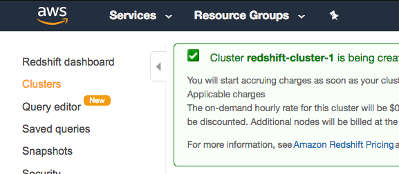

### Launching a Redshift Cluster in the AWS Console

   * Follow the instructions below to create a Redshift cluster
   * Use the query editor to create a table and insert data
   * Delete the cluster

Note: The steps below were introduced in lesson 2. You can use the IAM role and security group created in the last lesson.

### Launch a Redshift Cluster

**WARNING:** The cluster that you are about to launch will be live, and you will be charged the standard Amazon Redshift usage fees for the cluster until you delete it. **Make sure to delete your cluster each time you're finished working to avoid large, unexpected costs.** Instructions on deleting your cluster are included on the last page. You can always launch a new cluster, so don't leave your Redshift cluster running overnight or throughout the week if you don't need to.

   1. Open AWS Console by clicking on the ```Launch AWS Gateway``` button followed by ```Open AWS Console```.
   2. Search and select ```Redshift``` in the AWS Services search bar. This will open the Amazon Redshift Dashboard.
   3. On the Amazon Redshift Dashboard, choose **Create cluster**.


   4. On the Cluster details page, enter the following values and then choose Continue:
       * **Cluster identifier:** Enter ```redshift-cluster```.
       * **Database name:** Enter ```dev```.
       * **Database port:** Enter ```5439```.
       * **Master user name:** Enter ```awsuser```.
       * **Master user password** and **Confirm password:** Enter a password for the master user account.


   5. On the Node Configuration page, accept the default values and choose Continue.


   6. On the Additional Configuration page, enter the following values:
        **VPC security groups:** redshift_security_group
        **Available IAM roles:** myRedshiftRole

   Choose **Continue**.


   7. Review your Cluster configuration and choose Launch cluster.


   8. A confirmation page will appear and the cluster will take a few minutes to finish. Choose **Clusters** in the left navigation pane to return to the list of clusters.



   9. On the Clusters page, look at the cluster that you just launched and review the **Cluster Status** information. Make sure that the **Cluster Status** is **available** and the **Database Health** is **healthy** before you try to connect to the database later. You can expect this to take 5-10 minutes.


### Delete a Redshift Cluster

Make sure to delete your cluster each time you're finished working to avoid large, unexpected costs. You can always launch a new cluster, so don't leave it running overnight or throughout the week if you don't need to.

   1. On the **Clusters** page of your Amazon Redshift console, click on the box next to your cluster to select it, and then click on **Cluster > Delete cluster**.


   2. You can choose **No** for **Create snapshot**, check the box that you acknowledge this, and then choose **Delete**.


   3. Your cluster will change it's status to **deleting**, and then disappear from your Cluster list once it's finished deleting. You'll no longer be charged for this cluster.

