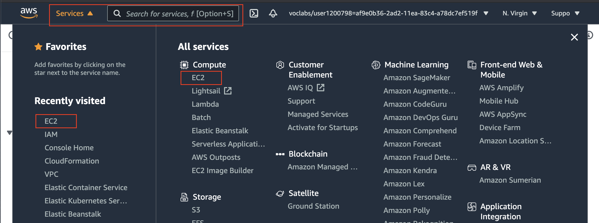
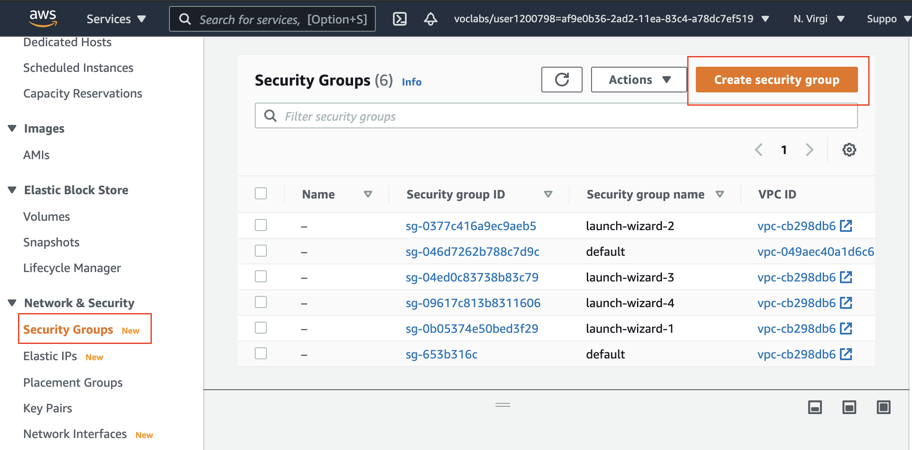
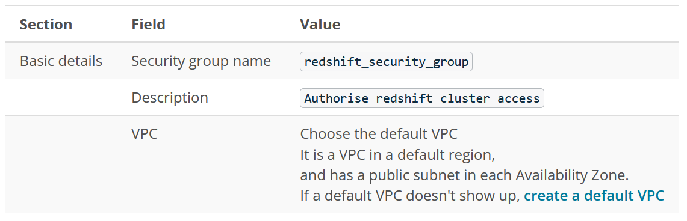
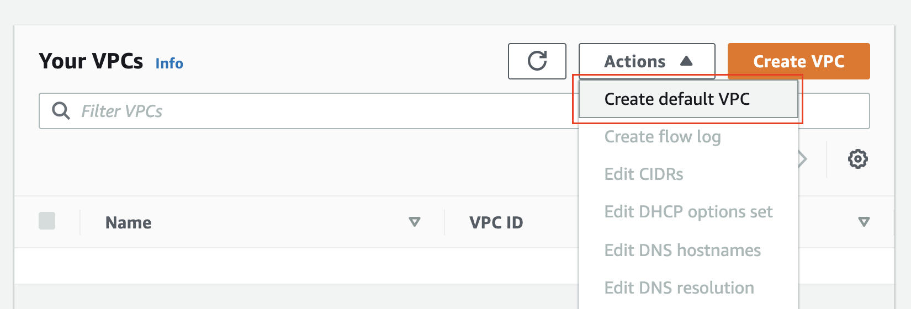
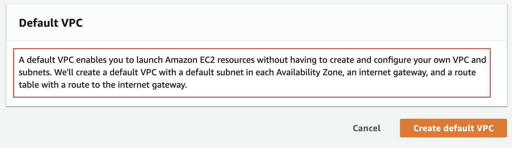
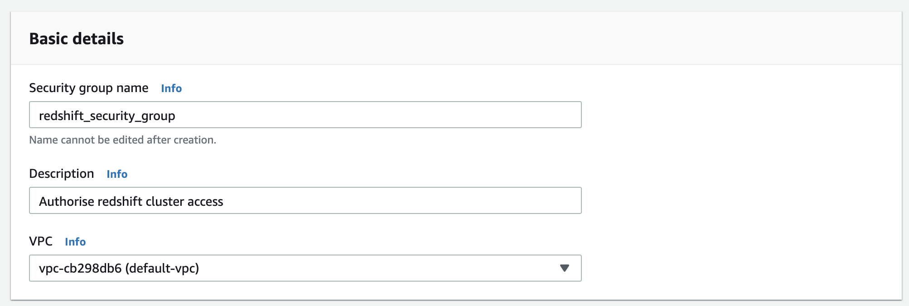
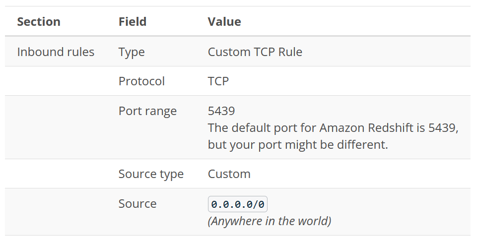
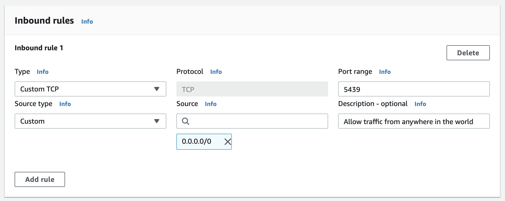
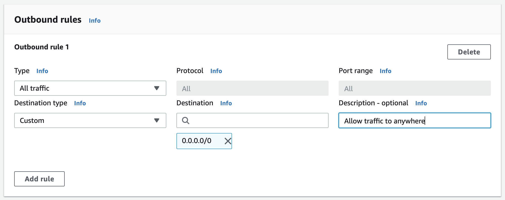
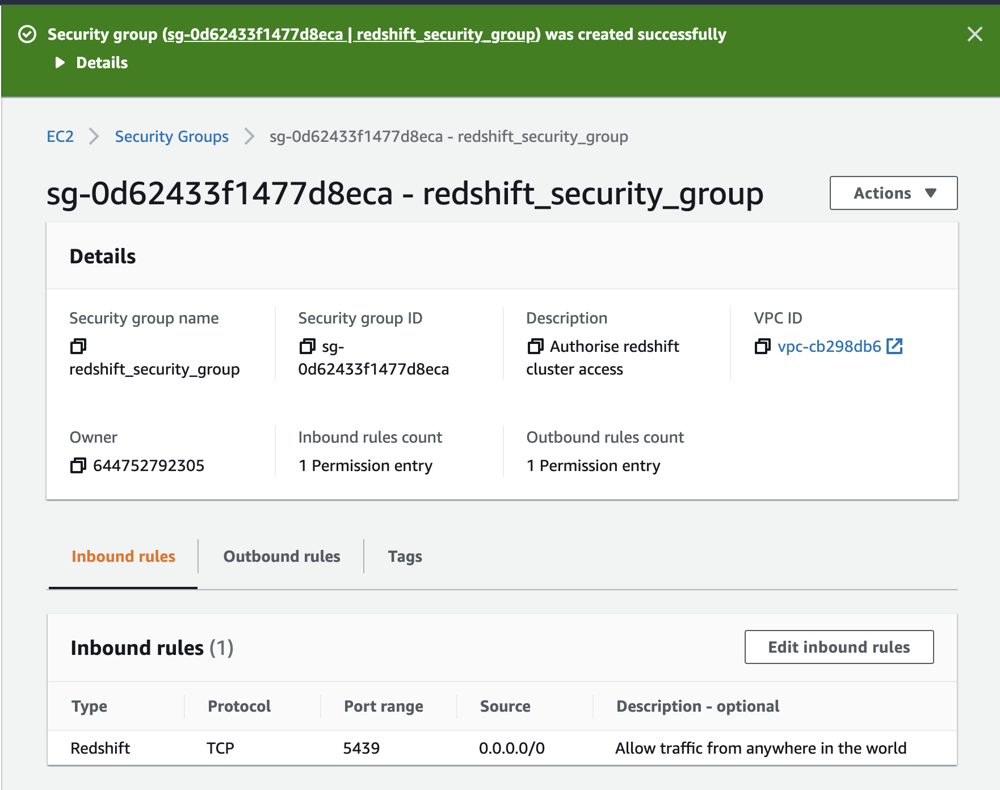

#### Create Security Group

Here, you'll create a security group you will later use to authorize access to your Redshift cluster.

   A security group will act as firewall rules for your Redshift cluster to control inbound and outbound traffic.

   1. Navigate to the [EC2 service](https://console.aws.amazon.com/ec2)

<br />

||
|:--:|
|*Navigate to any service*|

<br />

   2. Under **Network and Security** in the left navigation pane, select **Security Groups**. Click the **Create Security Group** button to launch a wizard.

<br />

||
|:--:|
|*Create a new security group*|

<br />

   3. In the Create security group wizard, enter the basic details.

<br />



<br />

||
|:--:|
|*Create a default VPC, if not available already*|


<br />

||
|:--:|
|*Info about a default VPC*|


<br />

||
|:--:|
|*Basic details*|

<br />

   4. In the Inbound rules section, click on **Add Rule** and enter the following values:

<br />



<br />

   **Important: Using ```0.0.0.0/0``` is not recommended for anything other than demonstration purposes because it allows access from any computer on the internet**. In a real environment, you would create inbound rules based on your own network settings.

<br />

||
|:--:|
|*Inbound rules*|

<br />

   5. Outbound rules allow traffic to anywhere by default.

<br />

||
|:--:|
|*Outbound rules*|

<br />


   6. Click on the Create security group button at the bottom. You will see a success message.

<br />

||
|:--:|
|*Details of a security group*|

<br />