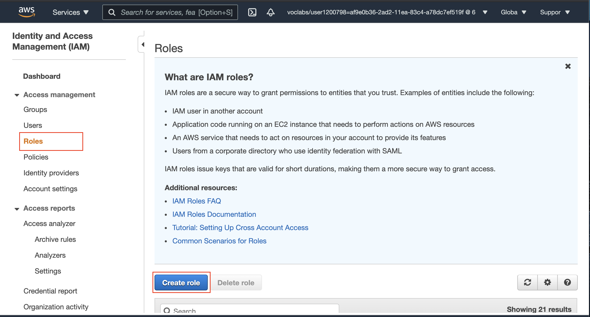
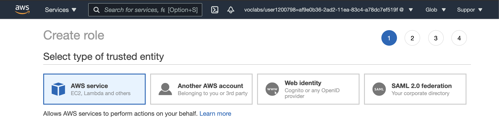
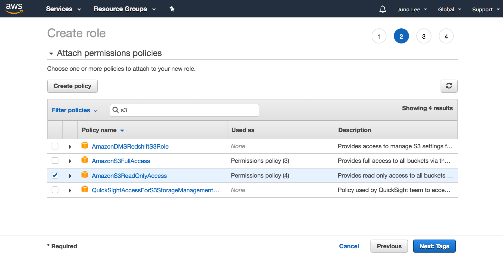
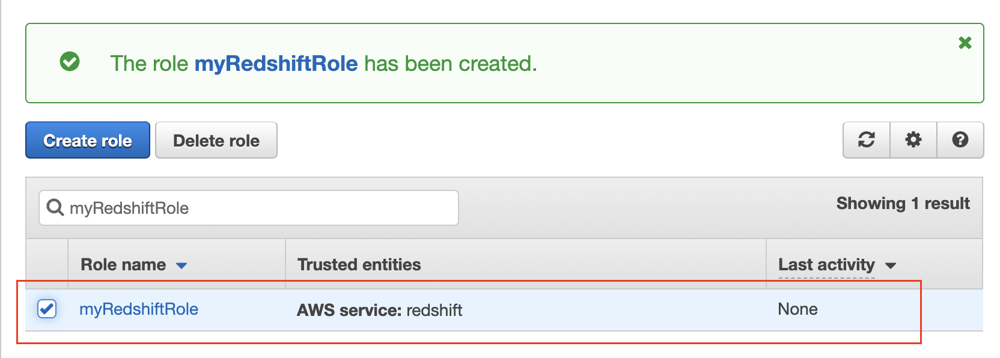

#### Create an IAM Role

Here, you'll create an IAM role that you will later attach to your Redshift cluster to enable your cluster to load data from Amazon S3 buckets. Read more about IAM roles and Redshift [here](https://docs.aws.amazon.com/redshift/latest/gsg/rs-gsg-create-an-iam-role.html).

   1. Once you have signed into the AWS management console, navigate to the [IAM service dashboard](https://console.aws.amazon.com/iam/).
   2. In the left navigation pane, choose **Roles**.
   3. Choose **Create role**.

<br />

||
|:--:|
|*IAM Roles dashbaord*|

<br />

   4. In the **AWS Service** group as the trusted entity, and choose **Redshift** service.
   5. Under **Select your use case**, choose **Redshift - Customizable**, and then **Next: Permissions**.

<br />



||
|:--:|
|*Select Redshift service, and Redshift - Customizable use case*|

<br />


   6. On the **Attach permissions policies page**, search for and select the **AmazonS3ReadOnlyAccess policy**, and then click on the **Next: Tags button**.
   7. Tags are optional. Click on the **Next: Review** button.

<br />

||
|:--:|
|*Select a policy to attach to the new role*|

<br />


   8. For **Role name**, enter ```myRedshiftRole```, and then choose **Create Role**.

<br />

||
|:--:|
|*Provide role name and description*|

<br />


   9. You will see a success message when the new role will be created.

<br />

||
|:--:|
|*Role created successfully*|

<br />

   That's great! On the next page, you'll learn to **attach this role to a new/existing cluster**.

