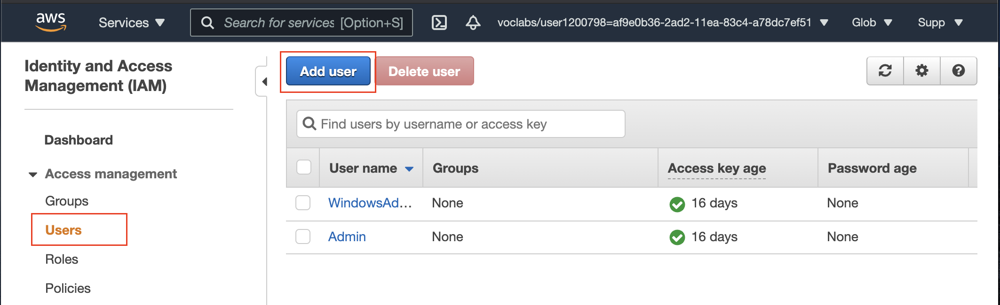
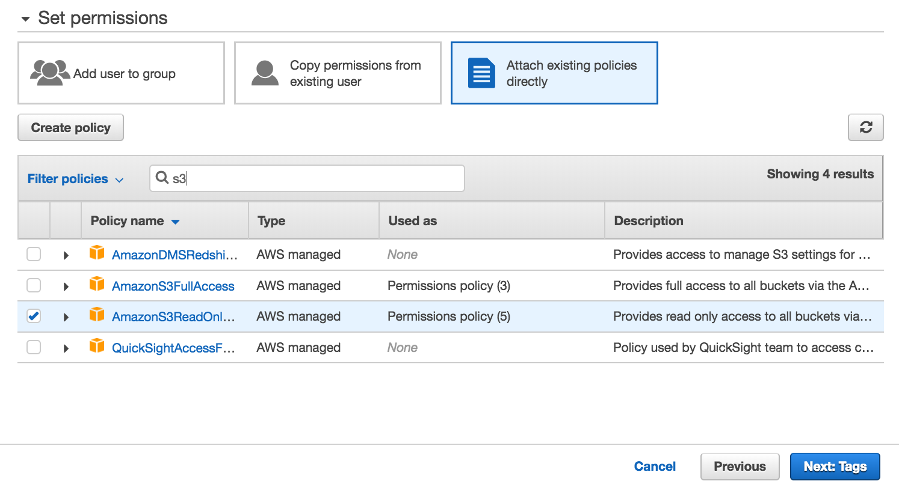

#### Create an IAM User

Here, you'll create an IAM user that you will use to access your Redshift cluster.

1. Navigate to the [IAM console](https://console.aws.amazon.com/iam/). In the left navigation pane, choose **Users**, and click on the **Add User** button. It will launch a new wizard.
 

||
|:--:|
|*IAM Users dashboard*|

 

2.  **Set user details**
    
    Enter a name for your user , say airflow_redshift_user, and choose Programmatic access. Then click on the Next: Permissions button.

 

||
|:--:|
|*Create IAM users → Set user details*|

 

3.  **Set permissions**

    Choose Attach existing policies directly option.
    * Search for redshift and select AmazonRedshiftFullAccess.
    * Then, search for S3 and select AmazonS3ReadOnlyAccess.
  After selecting both policies, choose Next: Tags. Skip this page and choose Next: Review.
  
 

||
|:--:|
|*Create IAM user → Set permissions → Select AmazonRedshiftFullAccess*|

 

||
|:--:|
|*Create IAM user → Set permissions → Select AmazonS3ReadOnlyAccess*|

 

4. **Review** your choices and finally click on the **Create user** button.

 

||
|:--:|
|*Review the new IAM user details*|

 

5. **Save your credentials!**
    
    This is the only time you can view or download these credentials on AWS. Choose **Download .csv** to download these credentials and then save this file to a safe location. You'll need to copy and paste this **Access key ID** and **Secret access key** in the next step.

We strongly advise you to keep this **Access key ID** and **Secret access key** closely guarded, including not putting them in a GitHub public repo, etc.

 

||
|:--:|
|*User created successfully.* 
***Copy the Access key Is and Secret access key.***|
 

