#### Launch a Redshift Cluster

**WARNING:** The cluster that you are about to launch will be live, and you will be charged the standard Amazon Redshift usage fees for the cluster until you delete it. **Make sure to delete your cluster each time you're finished working to avoid large, unexpected costs for yourself.** You can always launch a new cluster, so don't leave your Redshift cluster running overnight or throughout the week if you don't need to.

##### Getting Started

* Sign in to the AWS Management Console and open the Amazon Redshift console https://console.aws.amazon.com/redshift/

 

|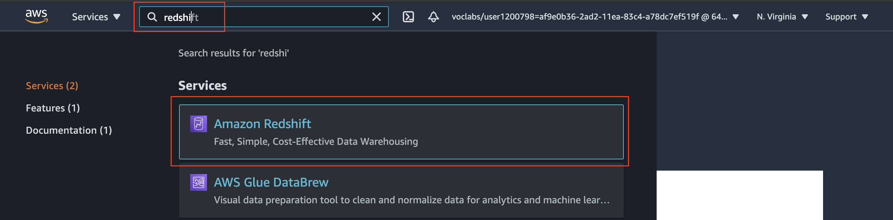|
|:--:|
|*Navigate to a new service*|

 

* On the Amazon Redshift Dashboard, choose **Create cluster**. It will launch the Create cluster wizard.

 

|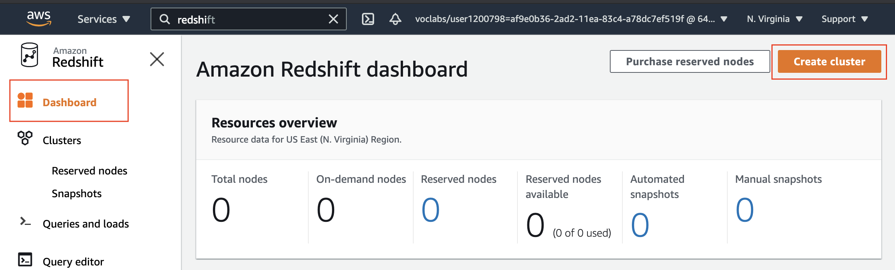|
|:--:|
|*Amazon Redshift dashboard*|

 

##### Prerequisite

1. **A cluster subnet group**

      A [cluster subnet group](https://docs.aws.amazon.com/redshift/latest/mgmt/working-with-cluster-subnet-groups.html) is logical group of subnets in your existing VPC in which yu want to create your Redshift cluster.

      * Within the Redshift service, and go to **Configurations → Subnet groups**.
      * Provide the subnet group name of your choice, choose the VPC, and add all subnets of the VPC to the current cluster subnet group. See the snapshots below.
      * Click on the "Create" button, and wait until the status shows "Complete".
  
|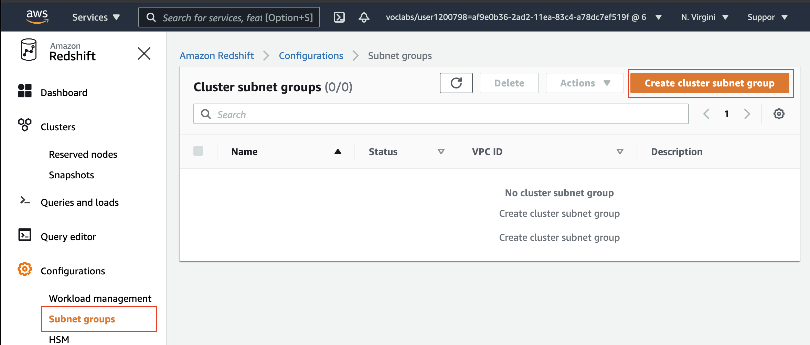|
|:--:|
|*Amazon Redshift → Configurations → Subnet groups*|

|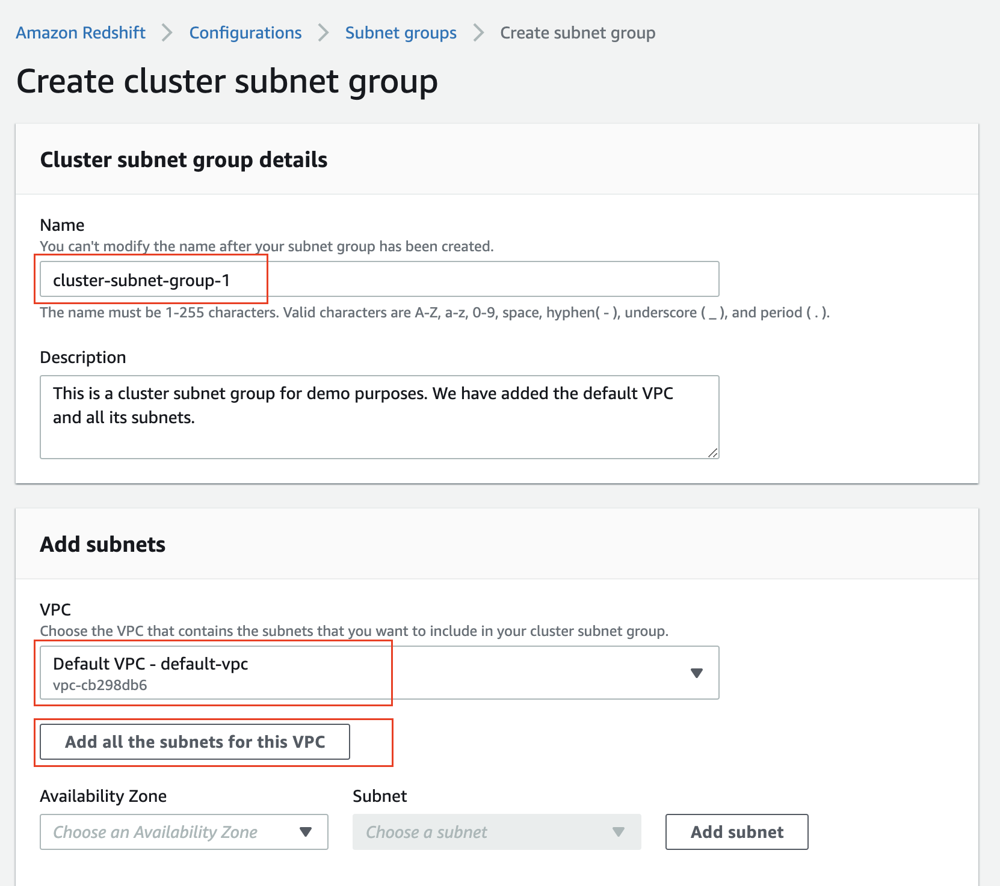|
|:--:|
|*Create a cluster subnet group from a default VPC*|

|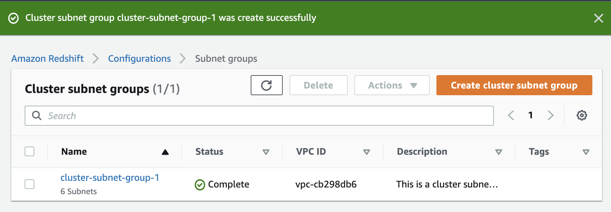|
|:--:|
|*Success message - Cluster subnet group*|

2. An IAM role, say **myRedshiftRole**, with *Redshift - Customizable* use case and `AmazonS3ReadOnlyAccess` policy attached.

3. A Security group, say **redshift_security_group**, that allows inbound traffic (from anywhere) on the port 5439 and outbound traffic to anywhere.

##### Cluster Creation

1. **Basic configuration**
    Provide a unique identifier, such as `redshift-cluster-1`, and choose the **Production** option because we want to change some of the default configuration.

    For the cluster size, choose 1 node of `dc2.large` hardware type. It is a high performance node with:
    * 2 vCPUs
    * fixed 160 GB SSD storage capacity

     

    |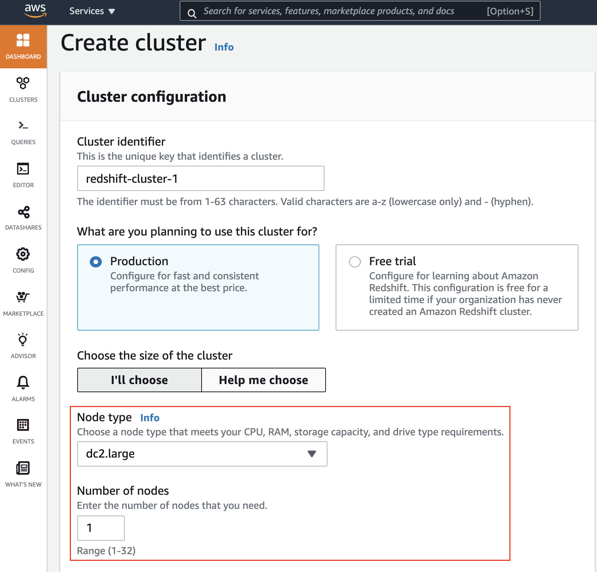|
    |:--:|
    |*Cluster's basic configuration*|

 

2. **Sample data**
    Select the checkbox to load the sample data to your Redshift cluster. It will load a sample dataset tickitDB with a sample database called TICKIT.

    |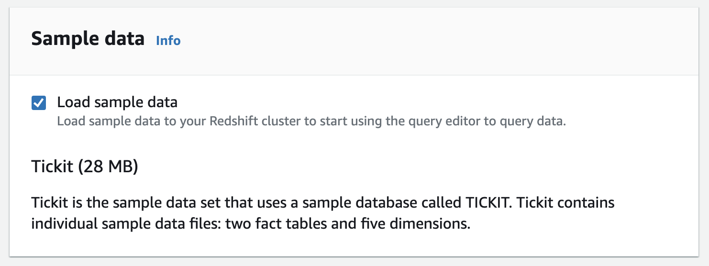|
    |:--:|
    |*Load sample data to your Redshift cluster*|

 

3. **Database configurations**
    Provide the username and password for the database.

    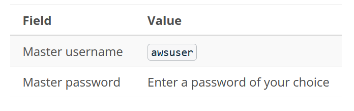

     

    **Please note:** We **strongly advise** you to keep these passwords closely guarded, including not putting them in your GitHub public repo, etc. 

    |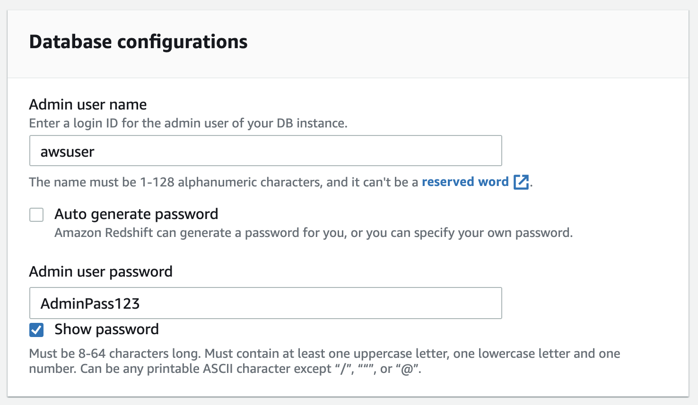|
    |:--:|
    |*Database configurations*|

 

4. **Cluster permissions**
    Choose the IAM role created earlier, *myRedshiftRole*, from the drop-down and click on the *Associate IAM role button*.
    
    |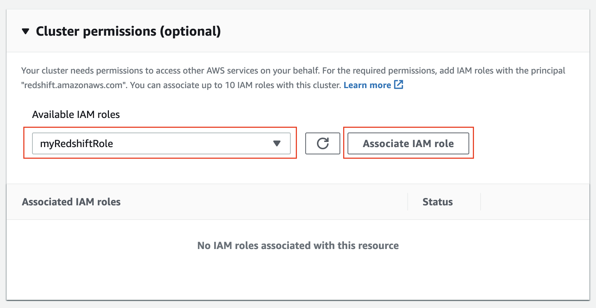|
    |:--:|
    |*Cluster permissions. Associate the custom IAM role.*|
    
 

5. **Additional configurations**
    * Toggle the button to turn off the "use defaults" feature,
    * Network and security - Choose the following values:
    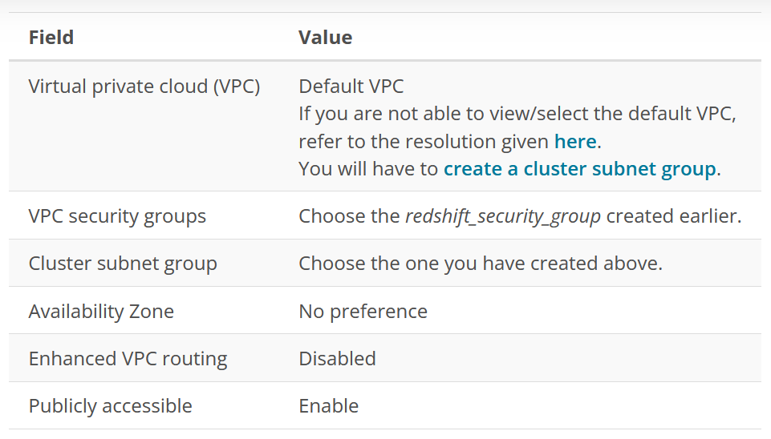
    
    ||
    |:--:|
    |*Do not use defaults in the Additional configurations*|
    
    |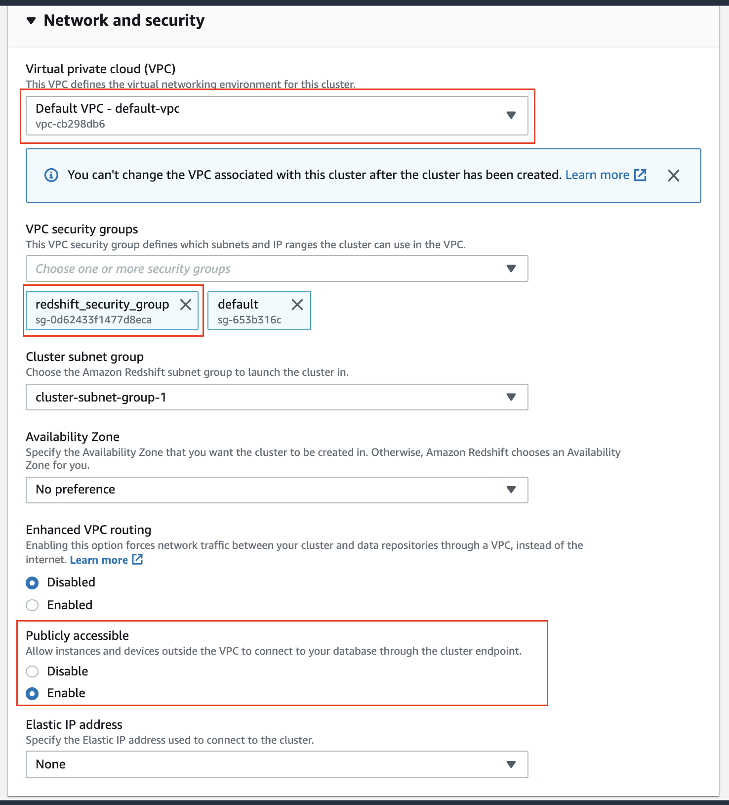|
    |:--:|
    |*Network and security section*|
    
     

    * **Additional database configurations:** The default database name and open port would be:
    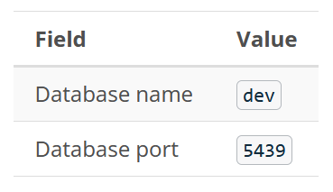
    
    |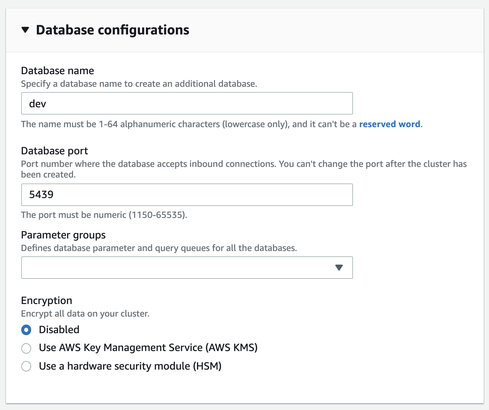|
    |:--:|
    |*Additional database configurations*|
    
 

6. Leave the remaining configurations as default. Review your Cluster configurations and click on the **Create cluster** button at the bottom. It will take a few minutes to create the cluster.

7. Click on the **Clusters** menu item from the left navigation pane, and look at the cluster that you just launched. Make sure that the **Status** is **Available** before you try to connect to the database later. You can expect this to take 5-10 minutes.

    |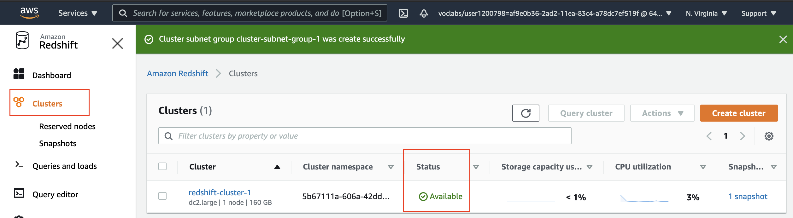|
    |:--:|
    |*If the status shows "Available", the Cluster is ready to be connected*|